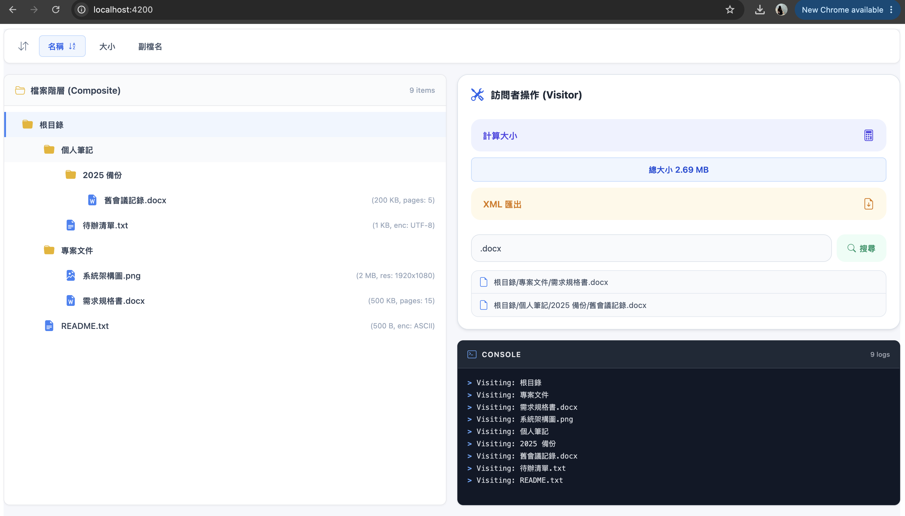
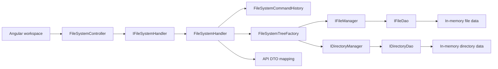
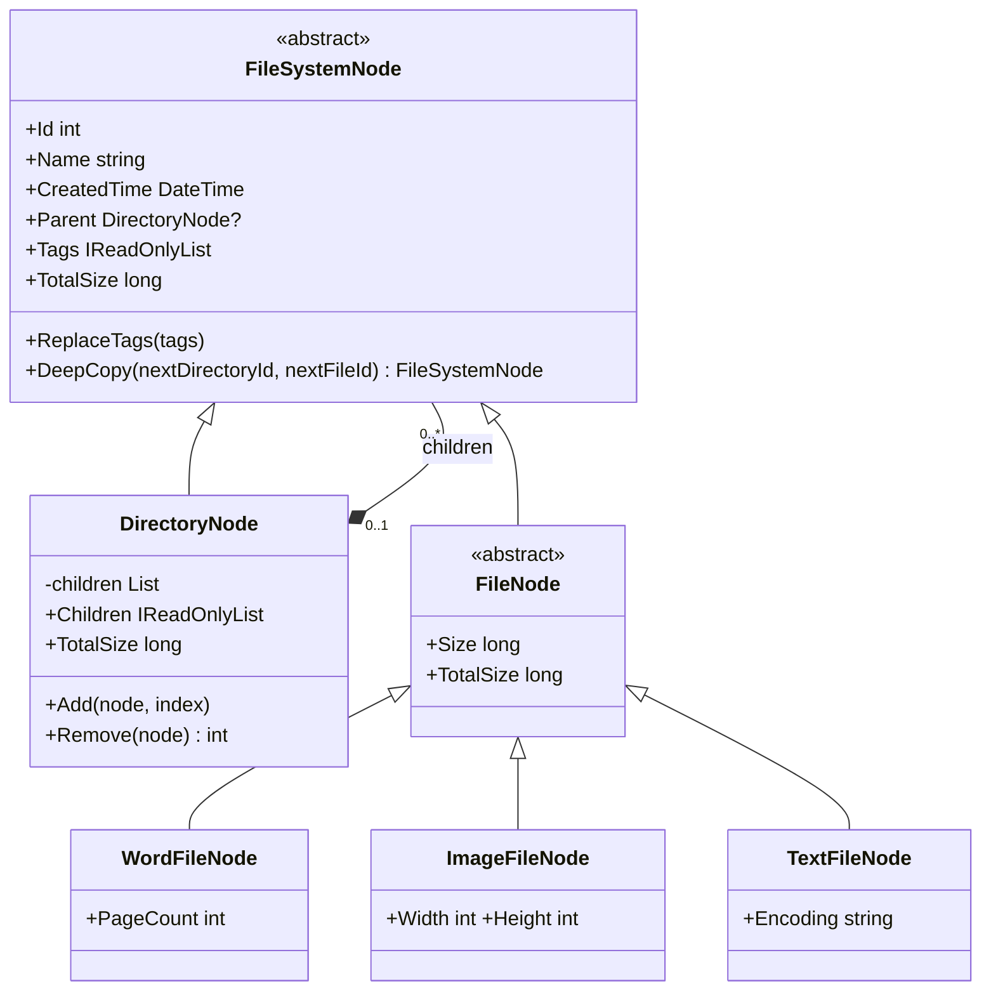
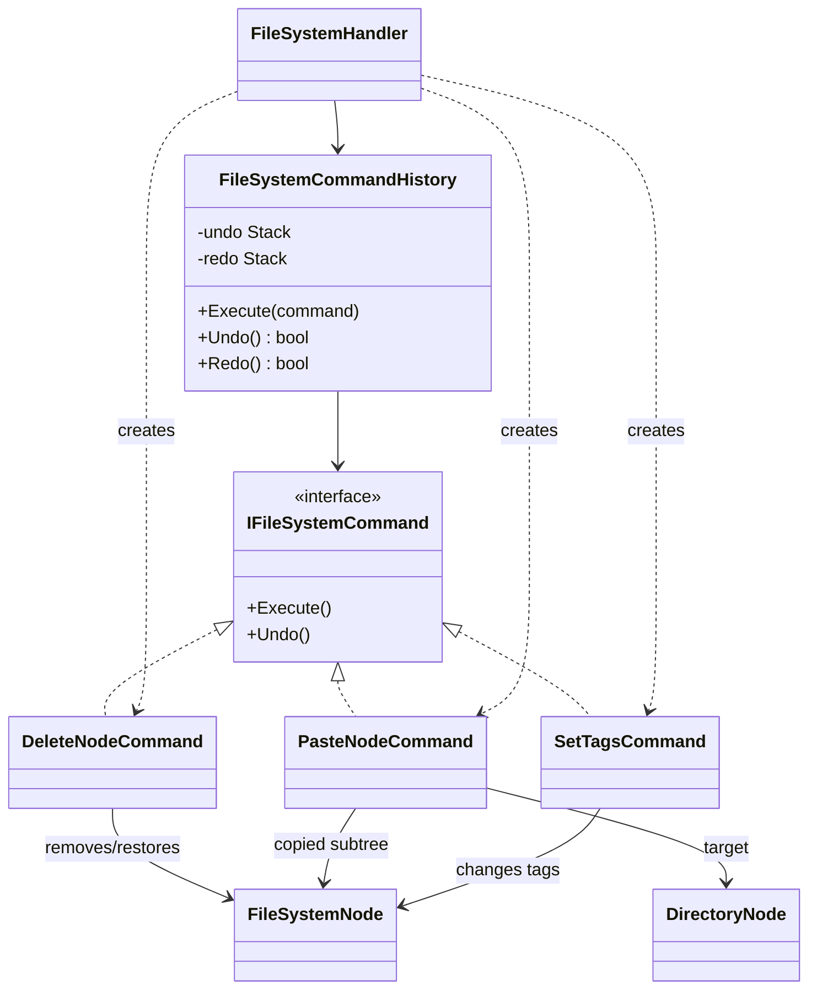
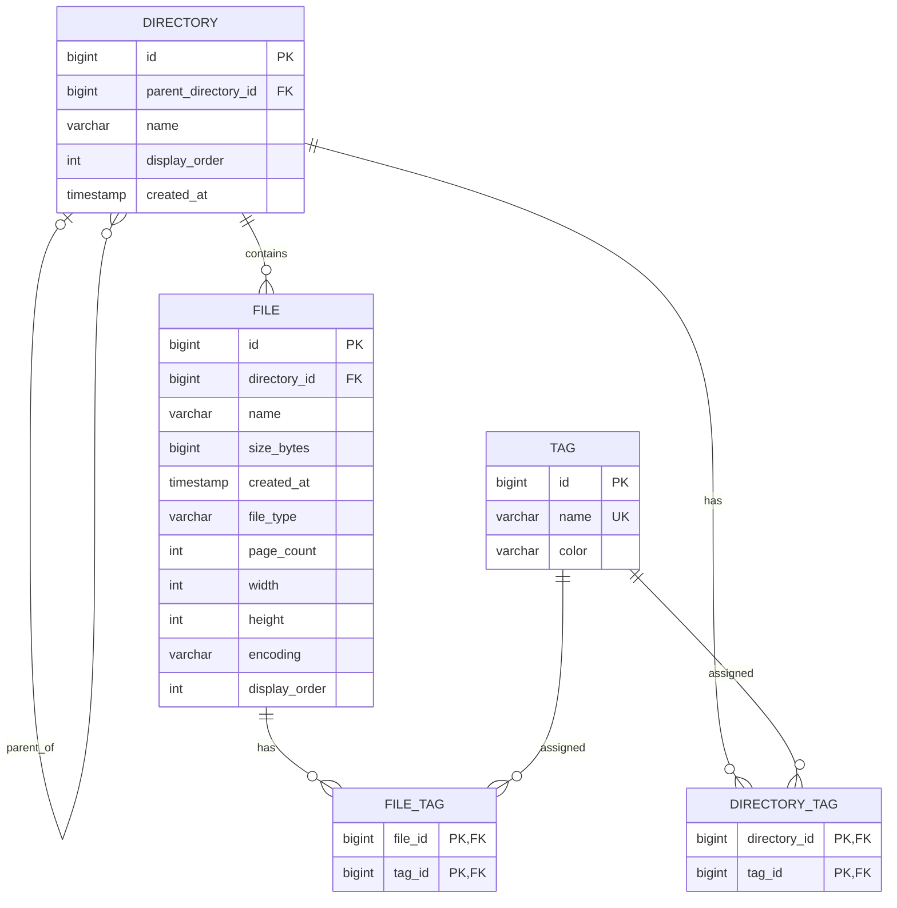

# Cloud File System

Cloud File System is an ASP.NET Core and Angular interview assignment that models recursive directories, typed files, traversal operations, editing, tags, and undo/redo. This V2 refactor keeps the original behavior and UI while making the domain model, dependency flow, test strategy, and architecture decisions explicit and executable.



## Architecture at a Glance



ASP.NET Core dependency injection composes the controller, handler, manager, and DAO boundaries. The handler constructs the concrete `FileSystemTreeFactory` from its injected managers. The application handler owns one in-memory filesystem aggregate and serializes access with a lock. Runtime persistence remains in memory by design.

## Assignment Scope

The source assignment asks for:

- Word, Image, and Text files with shared name, size, and creation time plus subtype metadata.
- Unlimited nested directories, with every file contained by a directory.
- The supplied sample hierarchy and readable details.
- Recursive total-size calculation.
- Extension search with full paths.
- XML serialization and traversal logs.
- UML and a proposed ER model.
- Bonus sorting, delete or copy/paste, colored multiple tags, and undo/redo.

The UI makes each requirement directly demonstrable. Layout work is intentionally secondary to domain and architecture clarity.

## What Was Enhanced

| Concern | Original implementation | V2 engineering refactor |
| --- | --- | --- |
| Runtime tree | One DTO-shaped node with enum checks and nullable subtype fields | Abstract Composite domain with directory and typed file subclasses |
| API contract | Domain and transport concerns shared one structure | Explicit domain-to-DTO mapping preserves Angular compatibility |
| Undo/Redo | Whole-tree snapshots inside the handler | Concrete commands retain only mutation-specific undo state |
| Construction | Handler and managers created concrete dependencies | Constructor injection from controller through DAO boundaries |
| Tests | Custom executable scenario runner | Discoverable xUnit unit and in-process HTTP integration tests |
| Coverage | No standard collector | Coverlet collector through `dotnet test --collect` |
| CI | Manual local verification | GitHub Actions for restore, build, tests, coverage artifact, and Angular build |
| Decisions | README audit notes | Focused ADRs tied to implemented code |
| Repository | ASP.NET template leftovers | Confirmed unused WeatherForecast template removed |

## Key Design Decisions

### Composite Domain Model

**Decision.** `FileSystemNode` is the abstract component. `DirectoryNode` is the composite and owns child nodes. `FileNode` is the leaf base, with `WordFileNode`, `ImageFileNode`, and `TextFileNode` as concrete leaves.

**Why.** Recursive containment and total size are inherent to the domain. Polymorphism prevents invalid combinations such as encoding on an image or page count on a text file. Parent links make full paths and containment rules explicit.

**Trade-off.** The stable frontend contract still uses a flat DTO with discriminators, so `FileSystemHandler.ToDto` maps the typed domain at the API boundary.

### Command Based Undo and Redo

**Decision.** `IFileSystemCommand` defines `Execute` and `Undo`. `FileSystemCommandHistory` is the invoker and history coordinator.

| Command | State retained for Undo |
| --- | --- |
| `DeleteNodeCommand` | Removed node, original parent, original index |
| `PasteNodeCommand` | Pasted subtree and target directory |
| `SetTagsCommand` | Old and new tag lists |

Executing a command pushes it to undo history and clears redo history. Undo moves it to redo history; Redo executes the same command again. Copy remains frontend clipboard state and is not mutation history. Paste is the mutation.

**Trade-off.** Command objects hold domain references and assume one in-memory aggregate. A database implementation would coordinate commands with transactions and persistence identity.

### Dependency Injection

The actual production chain is:

```text
FileSystemController
  -> IFileSystemHandler
  -> IFileManager / IDirectoryManager
  -> IFileDao / IDirectoryDao
  -> in-memory source data
```

`Program.cs` registers these dependencies. Controllers, handlers, and managers use constructor injection. Interfaces are limited to meaningful replaceable boundaries; domain entities and commands remain concrete.

### DAO and Persistence Boundary

Runtime storage stays in memory because the assignment evaluates modeling and recursive behavior, not database setup. DAO remains an accurate name for the current record-oriented data source. The proposed relational schema below describes an evolution path and is not implemented persistence.

## Domain Model



The runtime domain hierarchy lives under `Domain/`. Flat `DirectoryModel` and `FileModel` records represent source data read through DAOs. `FileSystemTreeFactory` validates and constructs the aggregate. API `Models/FileSystemNode.cs` is a transport DTO retained for client compatibility.

## Command and History Model



## Proposed Persistence Model

The application currently has no database, migrations, or physical tables. This ERD is the proposed production schema using table-per-hierarchy for file subtypes.



### Schema constraints and indexes

- `DIRECTORY.parent_directory_id` is nullable only for the root and references `DIRECTORY.id`.
- `FILE.directory_id`, names, sizes, timestamps, file type, tag names, and tag colors are `NOT NULL`.
- Recommended sibling uniqueness: `UNIQUE(parent_directory_id, name)` on directories and `UNIQUE(directory_id, name)` on files.
- `TAG.name` is unique. Junction tables use composite primary keys to prevent duplicate assignments.
- Index `DIRECTORY(parent_directory_id)`, `FILE(directory_id)`, `FILE(file_type)`, and both reverse tag lookup columns.
- Add `CHECK (size_bytes >= 0)` and positive-value checks for `page_count`, `width`, and `height` when those subtype fields are present.
- Constrain `file_type` to the supported Word, Image, and Text discriminator values, with subtype checks requiring the matching metadata and rejecting unrelated subtype values.
- Directory cycle prevention remains an application/domain invariant; the proposed self-referencing foreign key alone cannot reject an arbitrary multi-row cycle.
- The selected deletion strategy is application-controlled recursive deletion inside a transaction. Foreign keys use `RESTRICT` for directory/file ownership and `CASCADE` only from nodes or tags to their junction rows. This preserves command/audit control and avoids an unnoticed database cascade deleting a large subtree.

The single `FILE` table uses a `file_type` discriminator with nullable `page_count`, `width`, `height`, and `encoding`. This keeps common file queries simple for three compact subtypes. Detail tables become preferable if subtypes gain many fields, independent lifecycles, or stricter database-level subtype constraints.

## AI Assisted Engineering Workflow

```mermaid
flowchart LR
    R[Human requirements] --> A[Acceptance criteria]
    A --> RA[Repository analysis]
    RA --> G[Gap analysis]
    G --> C[Architecture constraints]
    C --> T[Test definition]
    T --> I[Implementation]
    I --> E[Test execution]
    E --> F[Failure analysis and fix]
    F --> V[Regression verification]
    V --> H[Human review]
```



### Human responsibilities

- Define assignment intent, acceptance criteria, protected behavior, and repository safety rules.
- Decide architecture constraints and approve trade-offs.
- Review the user experience and final engineering narrative.
- Own submission, commits, deployment, and final acceptance.

### AI agent responsibilities

- Inspect the repository and trace dependencies before editing.
- Compare code and documentation with the supplied specification.
- Propose and implement bounded changes inside human constraints.
- Add and execute tests, builds, coverage, and repository checks.
- Diagnose failures, fix regressions, and synchronize diagrams and claims with code.

The agent does not redefine product requirements or claim unverified patterns. Repository state and executable evidence take precedence over prompt assumptions.

## Testing Strategy

The original project was not developed entirely with strict TDD, and this repository does not make that claim.

### Regression protection

Existing assignment behavior was protected with regression tests covering sample data, metadata, recursion, search paths, XML, tags, copy/paste, collisions, validation, and history. Angular tests continue to protect UI behavior and API calls.

### Red Green Refactor used in V2

During the V2 refactoring session, selected architectural and behavioral changes followed Red-Green-Refactor where practical. This describes the working-session verification sequence; it does not imply that Git history contains separate RED commits.

1. **RED:** tests referenced absent `DirectoryNode`, typed leaves, `IFileSystemCommand`, and command history; compilation failed for those expected missing types.
2. **GREEN:** minimal Composite nodes and Delete/Tags command behavior made the first four architecture tests pass.
3. **REFACTOR:** the handler was moved onto the typed aggregate, Paste became a command, DI boundaries were wired, and the full regression and HTTP suites were rerun.
4. A regression test then exposed a lost XML alias; the serializer mapping was restored and the suite rerun.

### Test layers

| Layer | Location | Focus |
| --- | --- | --- |
| Domain unit | `Tests/Domain` | Composite ownership, polymorphic size, subtype safety |
| Application unit | `Tests/Application` | Commands, history, sample behavior, traversal, mutations, validation |
| HTTP integration | `Tests/Integration` | Real ASP.NET pipeline, payloads, status codes, state transitions |
| Angular component | `ClientApp/src/app/app.spec.ts` | Tree UI, metadata, operations, sorting, search, XML, history |
| Angular service | `ClientApp/src/app/service/file-system.service.spec.ts` | HTTP methods, URLs, parameters, bodies |
| External API smoke | `Tests/integration_test.py` | Separate API process and end-to-end HTTP sequence |

## Requirement Traceability

| Assignment requirement | Implementation | Automated evidence |
| --- | --- | --- |
| Sample hierarchy | `DirectoryDao`, `FileDao`, `FileSystemTreeFactory` | `Builds_required_sample_tree_and_type_metadata`; Angular rendering |
| Word/Image/Text metadata | Typed domain leaves and `ToDto` | Domain subtype test; handler metadata test; Angular metadata assertions |
| Recursive directories | `DirectoryNode.Children`, parent links | Composite ownership test; sample and deep-copy tests |
| Total size | `DirectoryNode.TotalSize` | Theory for Root, Project Docs, Personal Notes; HTTP integration |
| Extension normalization | `searchByExtension` | `docx` and `.DOCX` theory |
| Full paths and scope | Parent relationship and `Path()` | Full-path and subtree-scope tests; HTTP integration |
| XML serialization | `FileSystemHandler.ToXml` | XML hierarchy/metadata test; HTTP and Angular preview tests |
| Traverse log | `Visit` with parent path | Size/search log count and prefix assertions |
| Sorting | Angular `changeSort` / `sortTree` | Angular ASC/DESC tests for name, size, extension |
| Delete | `DeleteNodeCommand` | Command position test; handler and HTTP delete tests |
| Multiple tags | `SetTagsCommand` | Tag undo/redo test; Angular badges/history tests |
| Copy file | Polymorphic `DeepCopy`, Paste command | Metadata/tags/new identity test; HTTP and Angular tests |
| Copy directory | `DirectoryNode.DeepCopy` | Recursive identity/hierarchy/undo/redo test |
| Paste validation | Ancestry check and root guard | Root/self/descendant theory; HTTP bad-request test |
| Undo/Redo | `FileSystemCommandHistory` | Command and handler tests; HTTP and Angular state tests |

## Coverage

Backend coverage uses Coverlet's standard collector:

```sh
dotnet test Tests/CloudFileSystem.Tests.csproj --collect:"XPlat Code Coverage" --results-directory TestResults
```

CI uploads the generated Cobertura XML. Coverage is a signal for untested risk, not a substitute for meaningful assertions. Final measured metrics are recorded in the verification section only after generation from the final tree.

## Continuous Integration

`.github/workflows/ci.yml` runs on pushes and pull requests.

- Backend: restore, Release build, xUnit tests, and Coverlet collection.
- Frontend: deterministic `npm ci`, non-watch Angular tests, and production build.
- The workflow uses .NET 10 and Node 22, matching the repository's target framework and Angular 22 requirements.

## Architecture Decision Records

- [ADR 001 Domain Composite Model](docs/adr/001-domain-composite-model.md)
- [ADR 002 Command Based Undo and Redo](docs/adr/002-command-based-undo-redo.md)
- [ADR 003 In Memory Persistence Boundary](docs/adr/003-in-memory-persistence-boundary.md)
- [ADR 004 AI Agent Development Workflow](docs/adr/004-ai-agent-development-workflow.md)

## Trade-offs and Future Evolution

- Persist the aggregate through the existing DAO boundary when durability is required.
- Add optimistic concurrency and transactional command execution for multiple writers.
- Store binary content in object storage while retaining metadata in the relational model.
- Add authentication, authorization, ownership, and audit records before multi-user use.
- Use durable command/event records only if cross-session Undo/Redo becomes a requirement.
- Split read models from mutation models if tree size or query volume outgrows the current aggregate.

## How to Run

Prerequisites: .NET 10 SDK, Node.js 22 or another Angular 22 supported version, and npm.

```sh
# API from repository root
dotnet run --project CloudFileSystem.csproj --launch-profile http

# Frontend from another terminal
cd ClientApp
npm ci
npm start
```

Open `http://localhost:4200`. The frontend calls the API at `http://localhost:5182`.

### Verification commands

```sh
dotnet restore Tests/CloudFileSystem.Tests.csproj
dotnet build CloudFileSystem.csproj --no-restore
dotnet test Tests/CloudFileSystem.Tests.csproj --no-restore
python3 Tests/integration_test.py

cd ClientApp
npm ci
npm test -- --watch=false
npm run build
```

## Verification

This table is updated from commands executed against the final working tree.

| Gate | Result |
| --- | --- |
| Backend xUnit | 41 passed, 0 failed, 0 skipped |
| In-process HTTP integration | Included in the 41 xUnit tests |
| Separate-process HTTP smoke | PASS |
| Backend Release build | PASS, 0 warnings, 0 errors |
| Frontend tests | 10 passed in 2 files |
| Frontend production build | PASS, 396.41 kB initial bundle |
| Backend coverage | 54.81% line, 37.93% branch |
| Diff and conflict-marker checks | PASS |

Expected fixed-sample values:

- Root total: `2,815,476 B`
- Project Docs total: `2,609,152 B`
- Personal Notes total: `205,824 B`
- Root traversal: 9 nodes
- Root `.docx` search: 2 full paths
- XML root: `<根目錄_Root>`
