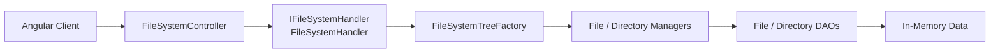
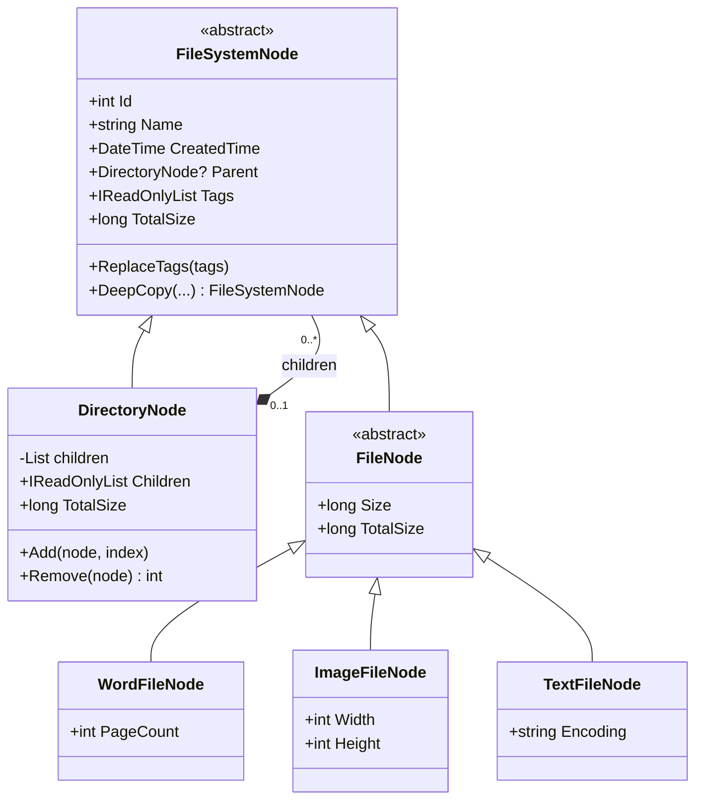
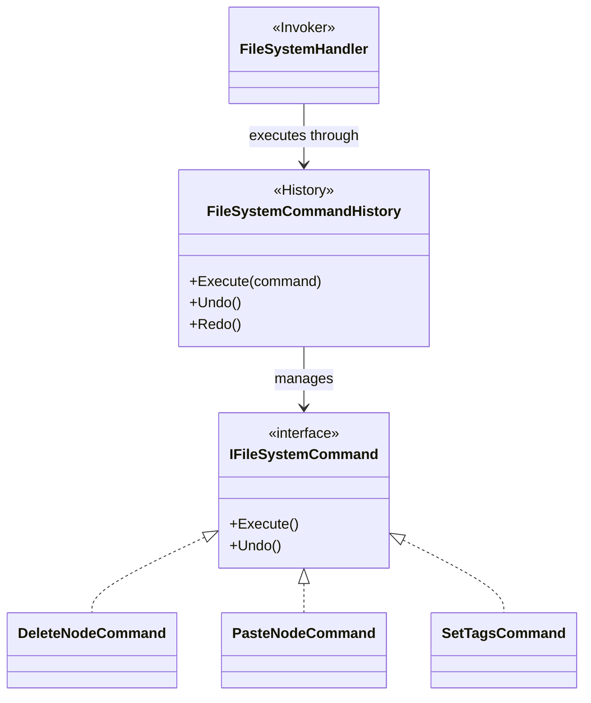
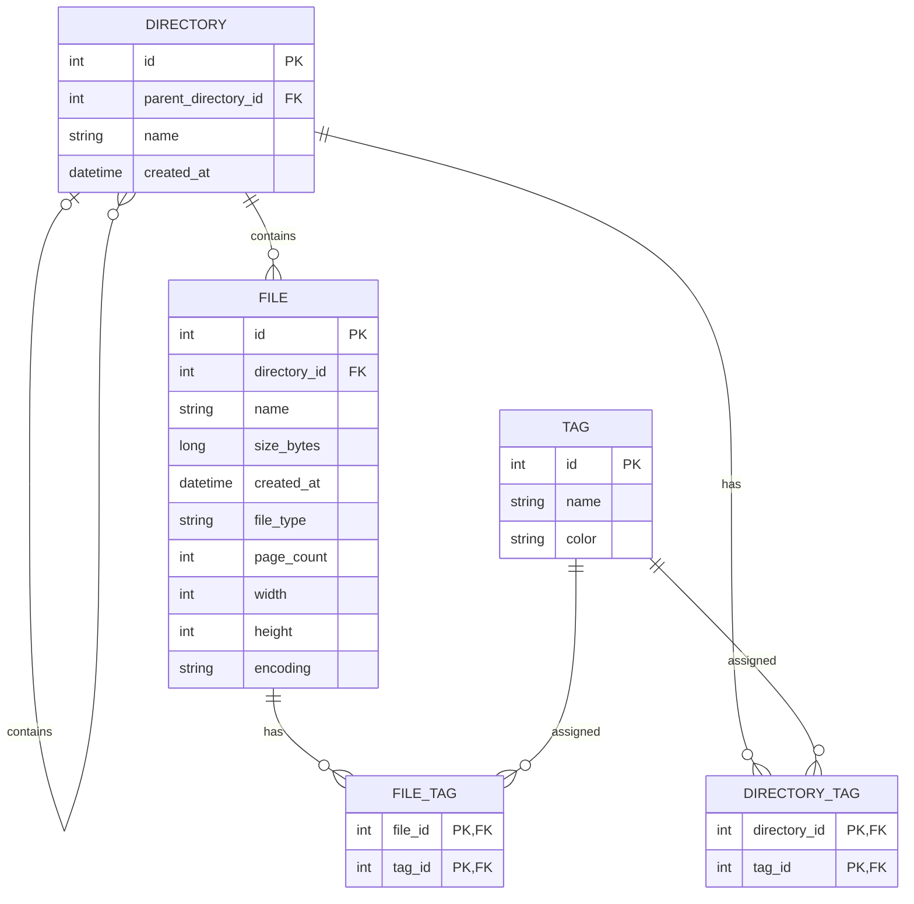

# Cloud File System

A cloud file management system implemented with **ASP.NET Core / C#** and **Angular**.

This project models a hierarchical file system containing directories and multiple file types, and supports recursive operations such as size calculation, extension search, XML serialization, copy/paste, tags, and Undo/Redo.

Beyond functional requirements, the enhanced version focuses on **domain modeling, design patterns, dependency injection, automated testing, CI, UML/ER design, and AI-assisted engineering workflow**.


---

## Project Overview

The system manages three file types:

- **Word** — page count
- **Image** — width and height
- **Text** — encoding

All files share:

- Name
- Size
- Creation time

Directories may contain both files and other directories with unlimited nesting depth.

### Core Features

- Recursive directory tree
- Recursive total-size calculation
- File search by extension with full paths
- XML serialization
- Traversal logging
- Sorting
- Tags
- Delete
- Copy / Paste
- Undo / Redo
- Angular Web UI

---

# Architecture Overview

The application follows a layered structure:

```text
Angular Client
      ↓
Controller
      ↓
Handler / Application Layer
      ↓
Manager
      ↓
DAO
      ↓
In-Memory Data Source
```



ASP.NET Core Dependency Injection composes the Controller, Handler, Manager, and DAO boundaries.

`FileSystemTreeFactory` is currently created by `FileSystemHandler` and reconstructs the typed domain tree from the data-access layer.

The runtime implementation intentionally remains **in-memory**. The DAO boundary keeps persistence concerns separated so that another persistence mechanism could be introduced later without changing the domain model.

---

# Domain Model

The file-system hierarchy is modeled using the **Composite Pattern**.

`FileSystemNode` defines the common abstraction for both directories and files.

- `DirectoryNode` is the composite and may contain other `FileSystemNode` objects.
- `FileNode` is the abstract leaf base class.
- `WordFileNode`, `ImageFileNode`, and `TextFileNode` provide file-type-specific metadata.



This structure allows recursive behavior to operate naturally on the hierarchy without relying on a single model containing file-type discriminator fields and many nullable properties.

The domain also protects important tree invariants such as preventing self-cycles, ancestor cycles, duplicate children, and multiple-parent ownership.

---

# Design Patterns

## Composite Pattern

The recursive file-system hierarchy uses the **Composite Pattern**.

```text
FileSystemNode
├── DirectoryNode
│   └── 0..* FileSystemNode
│
└── FileNode
    ├── WordFileNode
    ├── ImageFileNode
    └── TextFileNode
```

This allows directories and files to share the same base abstraction while `DirectoryNode` recursively contains other nodes.

Typical recursive operations such as total-size calculation and traversal can therefore operate naturally on the domain hierarchy.

---

## Command Pattern — Undo / Redo

Mutating operations that require Undo/Redo are modeled as commands.



`FileSystemHandler` creates concrete commands and executes them through `FileSystemCommandHistory`.

Each command encapsulates both its execution and rollback behavior:

- `DeleteNodeCommand` — removes and restores a node
- `PasteNodeCommand` — inserts and removes the copied subtree
- `SetTagsCommand` — changes and restores tags

This provides operation-specific Undo/Redo without storing a complete snapshot of the entire tree for every mutation.

---

## Layered Architecture

Responsibilities are separated into:

| Layer | Responsibility |
|---|---|
| Controller | HTTP/API boundary |
| Handler | Application workflow and file-system operations |
| Manager | Coordinates file/directory data access |
| DAO | Isolates the persistence/data source |
| Domain | File-system entities and domain behavior |

The separation keeps HTTP concerns, application workflow, persistence, and domain behavior from being tightly coupled.

---

## Dependency Injection

ASP.NET Core DI is used for the main application boundaries:

```text
FileSystemController
        ↓
IFileSystemHandler
        ↓
IFileManager / IDirectoryManager
        ↓
IFileDao / IDirectoryDao
```

This reduces direct construction of replaceable infrastructure dependencies and improves testability.

`FileSystemTreeFactory` remains a concrete helper created by the Handler rather than a separately injected abstraction.

---

# Proposed Persistence Model / ER Design

> The runtime implementation currently uses in-memory persistence.
>
> The following ER model represents a **proposed relational persistence design**, not an implemented database schema.



### File Inheritance Strategy

The proposed `FILE` table uses a **single-table / TPH-style strategy**.

`file_type` acts as the discriminator:

```text
Word
Image
Text
```

Subtype-specific columns are stored in the same table:

| File Type | Metadata |
|---|---|
| Word | `page_count` |
| Image | `width`, `height` |
| Text | `encoding` |

This keeps the persistence model simple for the current domain.

If file subtypes became substantially more complex, separate subtype/detail tables could be considered.

### Integrity Rules

The proposed persistence model should enforce:

- `size_bytes >= 0`
- Word files require a positive `page_count`
- Image files require positive `width` and `height`
- Text files require `encoding`
- `file_type` is restricted to `Word`, `Image`, or `Text`
- junction tables use composite primary keys
- files must belong to a directory

Directory-cycle prevention is treated as a **domain/application invariant**, since preventing arbitrary recursive cycles through relational constraints alone is not straightforward.

---

# Original vs Enhanced Implementation

The enhanced version focuses on improving architectural clarity and testability while preserving the original behavior.

| Concern | Original | Enhanced |
|---|---|---|
| File-system model | General node model with type discrimination | Typed Composite domain hierarchy |
| File types | Type-specific nullable fields | Word/Image/Text subclasses |
| Recursive structure | Tree assembled around generic nodes | `DirectoryNode` owns child nodes |
| Undo / Redo | Snapshot/history-oriented | Command Pattern |
| Dependencies | Direct construction in several paths | Constructor injection for main boundaries |
| Backend tests | Custom/lightweight verification | Standard xUnit test project |
| Integration tests | Limited | HTTP integration tests |
| CI | None | GitHub Actions |
| Architecture docs | Basic | UML, ER model, ADRs |
| AI usage | Implementation assistance | Constraint-driven engineering workflow |

---

# AI-Assisted Engineering Workflow

AI was used as an **engineering agent**, not as an autonomous replacement for architecture decisions.

The workflow followed:

```text
Requirements
    ↓
Repository Analysis
    ↓
Gap Analysis
    ↓
Human-defined Architecture Constraints
    ↓
Implementation / Refactoring
    ↓
Automated Tests
    ↓
Failure Analysis
    ↓
Targeted Fix
    ↓
Regression Verification
    ↓
Documentation Synchronization
    ↓
Final Review
```

## Responsibility Boundary

### Human

Responsible for:

- Requirements and acceptance criteria
- Architecture constraints
- Deciding which patterns were appropriate
- Preventing unnecessary over-engineering
- Reviewing AI-proposed changes
- Determining submission scope
- Final design decisions

### AI Agent

Used for:

- Repository analysis
- Identifying architecture/test gaps
- Implementing changes within defined constraints
- Generating test cases
- Running verification
- Analyzing failures
- Applying targeted fixes
- Synchronizing UML/documentation with implementation
- Final consistency review

AI-generated changes were not treated as correct by default.

Changes were verified through:

```text
Implementation
→ Automated Test
→ Failure Analysis
→ Fix
→ Regression Test
→ Build
→ Documentation Review
```

---

# Testing Strategy

The project uses **xUnit** for backend testing.

Tests are organized around:

```text
Tests/
├── Domain/
├── Application/
├── Integration/
└── TestSupport/
```

The test strategy distinguishes between two stages.

### Existing Behavior

Existing functionality was first protected with **regression tests** before architectural refactoring.

### V2 Refactoring

During the V2 working session, selected architectural and invariant changes followed a practical:

```text
RED
 ↓
GREEN
 ↓
REFACTOR
```

workflow.

The project does **not** claim that the original implementation was historically developed using strict TDD.

Examples of behavior covered by tests include:

- Recursive tree construction
- Word/Image/Text metadata
- Recursive total-size calculation
- Extension search
- Full paths
- XML serialization
- Traversal
- Delete
- Tags
- Copy/Paste
- Deep copy
- Parent relationships
- ID uniqueness
- Invalid Paste targets
- Undo/Redo
- Directory ownership invariants
- Cycle prevention
- Command-history failure consistency
- HTTP error mapping

---

# Example Red-Green-Refactor Cycle

During the targeted V2 hardening pass, new tests exposed several previously unhandled cases.

Examples included:

```text
Directory self-cycle
        ↓ RED
Domain invariant added
        ↓ GREEN
Regression suite
        ↓ PASS
```

and:

```text
Undo failure loses history entry
        ↓ RED
History transition corrected
        ↓ GREEN
Regression suite
        ↓ PASS
```

The same approach identified an empty-file-tree Paste issue and missing-directory HTTP error mapping.

---

# Verification

Final backend test result:

```text
41 passed
0 failed
0 skipped
```

Frontend:

```text
10 passed
```

Build verification:

```text
Backend Release Build    PASS
Frontend Production Build PASS
HTTP Integration          PASS
git diff --check          PASS
```

Current reproducible backend coverage:

```text
Line coverage:   54.81%
Branch coverage: 37.93%
```

Coverage is treated as a **verification signal rather than a target**. Tests prioritize domain invariants, recursive behavior, command history, copy/paste, validation, and HTTP integration instead of adding trivial tests solely to increase the percentage.

---

# Requirement → Test Traceability

| Requirement | Implementation | Verification |
|---|---|---|
| Recursive directories | `DirectoryNode` Composite | Domain tests |
| Word metadata | `WordFileNode` | Domain tests |
| Image metadata | `ImageFileNode` | Domain tests |
| Text metadata | `TextFileNode` | Domain tests |
| Recursive size | `TotalSize` | Domain/Application tests |
| Extension search | Handler traversal/search | Application tests |
| Full path | Parent hierarchy | Application tests |
| XML serialization | Recursive serialization | Application/Integration tests |
| Traversal logging | Recursive traversal | Application tests |
| Sorting | Application logic | Regression tests |
| Delete | `DeleteNodeCommand` | Command tests |
| Tags | `SetTagsCommand` | Command tests |
| Copy/Paste | Deep copy + `PasteNodeCommand` | Application/Command tests |
| Undo/Redo | `FileSystemCommandHistory` | Command tests |
| HTTP API | Controller/Handler | Integration tests |

---

# CI

GitHub Actions runs verification on:

```text
push
pull_request
```

The CI pipeline verifies:

### Backend

```text
Restore
→ Build
→ xUnit Tests
→ Coverage
```

### Frontend

```text
npm ci
→ Angular Tests
→ Production Build
```

This ensures the repository can be verified in a clean environment rather than relying only on the developer's local machine.

---

# How to Run

## Backend

From the repository root:

```bash
dotnet restore
dotnet run
```

## Backend Tests

```bash
dotnet test Tests/CloudFileSystem.Tests.csproj
```

## Backend Coverage

```bash
dotnet test Tests/CloudFileSystem.Tests.csproj --collect:"XPlat Code Coverage" --results-directory TestResults
```

## Frontend

```bash
cd ClientApp
npm ci
npm start
```

## Frontend Tests

```bash
cd ClientApp
npm test -- --watch=false
```

## Frontend Production Build

```bash
cd ClientApp
npm run build
```

---

# Architecture Decisions

Detailed architecture decisions are documented under:

```text
docs/adr/
├── 001-domain-composite-model.md
├── 002-command-based-undo-redo.md
├── 003-in-memory-persistence-boundary.md
└── 004-ai-agent-development-workflow.md
```

The ADRs document the context, chosen design, alternatives considered, consequences, and trade-offs behind the main architectural decisions.

---

# Current Limitations

The project intentionally remains scoped to the assignment.

Current limitations include:

- Runtime persistence is in-memory.
- The file-system aggregate and Undo/Redo history are shared singleton state.
- Multi-user isolation and authentication are not implemented.
- Command execution is not backed by database transactions.
- The API DTO retains `nodeType` / `fileType` discriminators for compatibility with the Angular client.
- The ER model represents a proposed persistence design rather than an implemented database.

These are deliberate scope boundaries rather than hidden implementation claims.

---

# Summary

The enhanced implementation focuses on keeping one consistent engineering story:

```text
Requirements
    ↓
Domain Model
    ↓
Architecture Decisions
    ↓
Design Patterns
    ↓
Implementation
    ↓
Tests
    ↓
AI-Assisted Verification
    ↓
CI
    ↓
Documentation
```

The two primary design patterns used are:

**Composite Pattern**  
for the recursive file-system domain model.

**Command Pattern**  
for mutation-specific Undo/Redo behavior.

The overall goal is not to maximize the number of abstractions or patterns, but to keep the implementation, UML, ER design, tests, and documentation consistent with the actual problem being solved.
