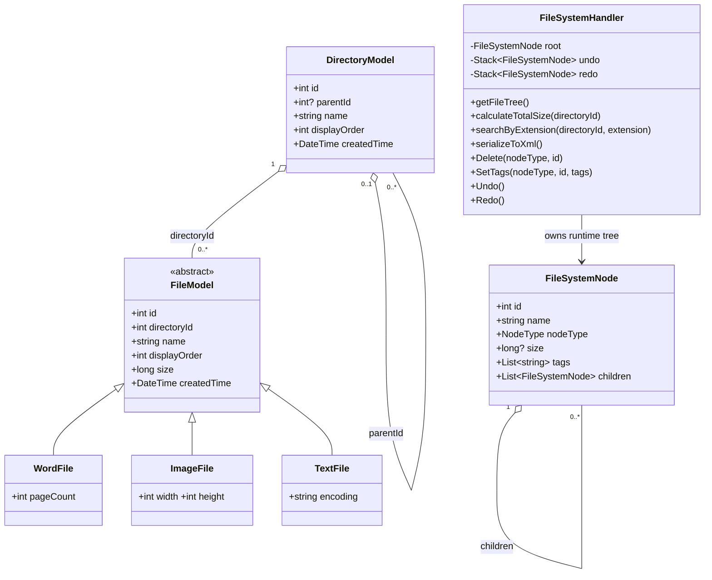
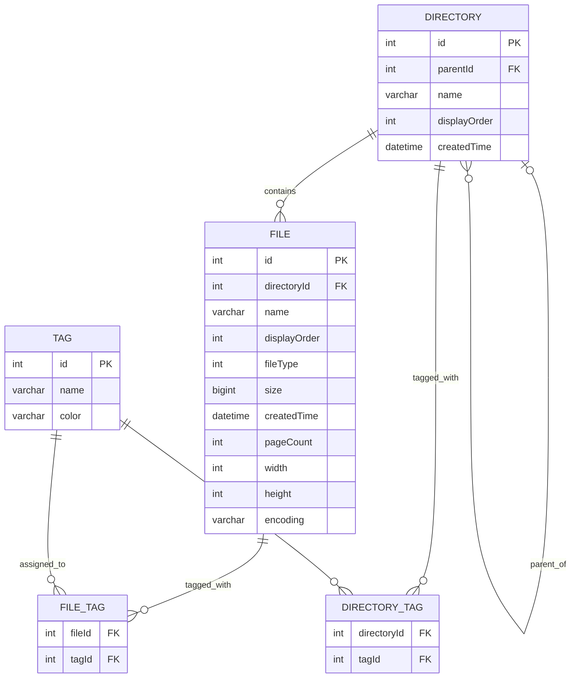

# Cloud File System

## 1. Project Overview

Cloud File System is an interview assignment implemented with ASP.NET Core, C#, Angular, and TypeScript. It models an unlimited directory hierarchy, three file types, recursive operations, process logging, XML serialization, and the requested bonus operations.

The repository contains a fixed in-memory sample rather than a database. The ER diagram documents a proposed persistence schema; it does not claim that those tables or migrations exist.

The web UI exposes the tree, file-specific metadata, recursive operations, tags, history state, progress, and traversal logs so a reviewer can verify behavior without browser console output.


## 2. Original Requirements

The original assignment asks for:

- A UML domain model showing inheritance and directory relationships.
- An ER model for a possible persistence design.
- Word, Image, and Text files with common and type-specific properties.
- An unlimited directory hierarchy in which every file belongs to a directory.
- The supplied sample tree and file metadata.
- Recursive size calculation and search by extension with full paths.
- XML serialization and traversal logs.
- Bonus sorting, editing, colored multiple tags, and Undo/Redo.

## 3. Original vs Enhanced Implementation

| Area | Original repository baseline | Enhanced implementation | Reason |
| --- | --- | --- | --- |
| Sample data | Core file and directory classes existed | Exact required tree, stable display order, byte-accurate sizes | Reproducible expected outputs |
| Tree validation | Assumed valid data | Validates one root, unique IDs, parents, reachability, and cycles | Protect recursive operations |
| Size | Recursive calculation | Hierarchical traversal logs and readable units | Visible, testable recursion |
| Search | Basic extension search | Accepts `docx`/`.docx`, ignores case, respects subtree scope, returns root-based paths | Covers requirements and edges |
| XML | Structure serialization | Required aliases/details, UI preview, and download | Direct reviewer verification |
| Editing | Limited or absent | File/directory delete with root protection | Selected editing bonus |
| Copy/Paste | Absent | Frontend clipboard plus backend recursive deep copy with new identities | Completes the second editing option without duplicating domain logic in the UI |
| Tags | Limited or absent | Urgent, Work, Personal; multiple tags per node | Complete tag bonus |
| Undo/Redo | Limited or absent | Snapshot history for delete and tag changes | Consistent full-state restore |
| Frontend | Functional Angular view | Reference-oriented workspace, inline search highlighting, progress, Console | Demonstrable requirements |
| Verification | No complete regression story | Core, HTTP, Angular tests, browser checks, and builds | Repeatable evidence |

## 4. Architecture Overview

```text
Angular Component -> FileSystemService -> HTTP API
-> FileSystemController -> FileSystemHandler
-> IFileManager / IDirectoryManager
-> FileManager / DirectoryManager -> FileDao / DirectoryDao -> Models
```

| Layer | Actual implementation | Responsibility |
| --- | --- | --- |
| Presentation | `FileSystemComponent` | Tree, selection, sorting, search highlighting, XML, progress, Console |
| Client API | `FileSystemService` | Typed HTTP calls |
| Controller | `FileSystemController` | Routes requests and maps errors to HTTP responses |
| Application logic | `FileSystemHandler` | Tree validation, recursion, serialization, editing, deep copy, history |
| Manager boundary | `IFileManager`, `IDirectoryManager` and implementations | Supplies source collections |
| Data access | `FileDao`, `DirectoryDao` | Creates the fixed sample dataset |
| Domain | Models and `FileSystemNode` | Source records and runtime tree |

This is a real layered call chain, but the sample is intentionally small. Managers instantiate concrete DAOs, and the default handler constructor instantiates concrete managers. Tests inject manager interfaces; production wiring does not provide full dependency inversion for every layer.

## 5. Domain UML



### UML to implementation mapping

- `FileModel` is abstract; its three subclasses add page count, resolution, or encoding.
- `DirectoryModel.parentId` models recursive directories; `FileModel.directoryId` assigns every file to a directory.
- `FileSystemHandler.buildTree(...)` converts flat DAO records into `FileSystemNode.children`.
- `calculateNodeSize(...)`, `searchFilesByExtension(...)`, `serializeNodeToXml(...)`, `Find(...)`, and `FindParent(...)` recursively traverse that hierarchy.

## 6. ER and Schema Design

This is a proposed relational schema. The application has no database, migrations, or physical tables.



The proposed `FILE` table uses single-table inheritance: `fileType` is the discriminator and type-specific columns are nullable. If file types acquire many fields, table-per-type or separate detail tables would reduce sparse columns.

`DIRECTORY.parentId` is nullable for the root and self-references descendants. `FILE.directoryId` is non-null. The handler constructor validates equivalent runtime invariants. Tags currently live in memory; the join tables show how multiple tags could be normalized if persistence were added.

## 7. Design Patterns

### Composite pattern variant — PARTIAL

| Question | Answer |
| --- | --- |
| Problem | Directories contain files and directories; recursive operations need one traversable shape. |
| Why selected | A shared node representation supports the same recursion for every node. |
| Participants | Component: `FileSystemNode`; composite instances: `nodeType == directory`; leaf instances: `nodeType == file`; client: `FileSystemHandler`. |
| Actual classes/methods | `FileSystemNode.children`; `buildTree`, `calculateNodeSize`, `searchFilesByExtension`, `serializeNodeToXml`, `Find`, `FindParent`. |
| Benefit | Uniform traversal, arbitrary depth, one API/UI shape. |
| Trade-off | Nullable type fields and `nodeType` checks reduce compile-time type safety. |

This is **PARTIAL** because one concrete `FileSystemNode` uses a discriminator. There are no separate Component, Leaf, and Composite types with a shared operation interface. The structure and traversals follow Composite concepts; the class model is a simplified variant.

Copy/Paste uses this tree structure directly: `Paste(...)` validates the source and target, and `DeepCopyWithNewIds(...)` recursively copies an entire subtree. Every copied directory and file receives the next available ID for its node type. Containment in the copied `children` lists rebuilds the runtime parent relationships; the in-memory runtime node intentionally has no `parentId` or `directoryId` field.

### Command pattern — FAIL as a full pattern

There is no command interface, concrete command object, or command-owned `Execute`/`Undo`. `FileSystemHandler.Delete` and `SetTags` mutate state directly, so this repository must not claim a complete Command Pattern.

Undo/Redo uses snapshot history: `SaveForUndo()` clones the root; `_undo` and `_redo` store tree snapshots; `Undo()` and `Redo()` exchange the current root with a snapshot. This is closer to a **Memento-style concept**, but remains **PARTIAL** because there is no explicit Memento type or separate caretaker/originator structure. It is simple and reliable for this small tree, at the cost of cloning the whole tree per edit.

Paste uses the same snapshot history as Delete and tag changes. Copy only updates the frontend clipboard and creates no history entry. Paste calls `SaveForUndo()` once before attaching the copied root, so one Undo removes the entire pasted subtree and Redo restores it.

### Prototype pattern — not claimed

`DeepCopyWithNewIds(...)` is a purpose-specific recursive copy function. Domain objects do not expose a clone/copy protocol and are not created through polymorphic prototypes. The implementation is therefore documented as **Recursive Deep Copy**, not Prototype Pattern.

### Copy/Paste policies

- Clipboard state: `FileSystemComponent.clipboardItem`; Copy performs no server mutation.
- Backend mutation: `POST /api/FileSystem/pasteNode` sends source node type/ID and target directory ID.
- IDs: directory and file IDs use independent next-ID sequences, matching the existing model.
- Names: every pasted root receives ` - Copy`; repeated collisions use ` - Copy (2)`, ` - Copy (3)`, and so on. File extensions remain at the end.
- Tags: copied because they are part of the visible node state; the copied list is independent.
- Data: size, created time, file type, page count, dimensions, encoding, tags, and descendants are preserved.
- Guards: Root cannot be copied; target must be a directory; a directory cannot be pasted into itself or a descendant. Backend is the final integrity guard, with matching frontend button states.

### Layered Architecture — PASS with limitations

`FileSystemController -> FileSystemHandler -> Manager -> DAO -> Models` exists in executable code, and each layer has a distinct role. Dependency inversion is incomplete because the production path constructs concrete managers and DAOs.

### DAO separation — PASS for in-memory scope

`DirectoryDao.getAllDirectories()` and `FileDao.getAllFiles()` isolate sample data construction from traversal and HTTP code. They are concrete in-memory DAOs, not database repositories; there is no transaction, query, or migration layer.

Inheritance among file types is domain modeling, not by itself a behavioral pattern. Recursion is an algorithmic technique. These are intentionally kept separate from pattern claims.

## 8. AI-Assisted Development Workflow

```text
Requirement -> Repository Analysis -> Gap Analysis
-> Architecture Constraints -> Implementation -> Tests
-> Failure Analysis -> Fix -> Regression Test -> Final Gap Analysis
```

### Human responsibilities

- Supplied the assignment, screenshots, acceptance criteria, and repository constraints.
- Chose the sample data and expected presentation.
- Prohibited destructive Git operations and unnecessary backend redesign.
- Reviewed intermediate work and refined behavior such as inline search highlighting.
- Retains responsibility for submission, commits, and architectural approval.

### AI Agent responsibilities

- Inspected the actual repository and compared it with the source requirements.
- Preserved uncommitted work and made bounded changes.
- Traced requirements to classes, methods, APIs, UI behavior, and tests.
- Implemented gaps within the architecture without adding frameworks.
- Performed browser verification, tests, builds, failure analysis, fixes, and regression runs.
- Reported architectural limitations instead of inventing pattern claims.

### Controls and verification

- Checked repository state before edits and avoided destructive Git commands.
- Treated backend contracts and domain design as constraints during UI work.
- Verified behavior at handler, HTTP, Angular service/component, build, and browser levels.
- Used failures as feedback: missing Created Time labeling, obsolete Empty State assertions, and an Angular CSS budget failure were fixed and rerun.
- Used `git diff --check` to detect whitespace errors.

This is a **test-oriented, TDD-inspired workflow**. The project did not begin as strict Red-Green-Refactor and does not claim pure TDD.

## 9. Testing Strategy

| Level | Files | Purpose |
| --- | --- | --- |
| Core | `Tests/Program.cs` | Tree, exact values, recursion, paths, XML, history, deep copy, collisions, errors, invalid fixtures |
| HTTP integration | `Tests/integration_test.py` | Fresh API process, routes, payloads, status codes, state transitions |
| Angular component | `ClientApp/src/app/app.spec.ts` | Rendering, operations, sorting, tags, history, XML, search states |
| Angular service | `ClientApp/src/app/service/file-system.service.spec.ts` | URLs, parameters, methods, payloads |
| Build gates | .NET and Angular builds | Compiler, templates, bundling, budgets |
| Manual UI | Browser session | Visible interaction and layout behavior |

The core runner is dependency-light and reports eight named scenarios. It is not xUnit/NUnit and provides no framework-level discovery or coverage metrics, but its assertions execute against the real handler and injectable manager fixtures.

## 10. Requirement to Test Traceability

| Requirement | Implementation | Unit test | Integration/UI test | Result |
| --- | --- | --- | --- | --- |
| Sample tree and details | DAOs, `buildTree`, subclasses | `sample tree and details` | Angular sample rendering | PASS |
| Recursive size | `calculateTotalSize`, `calculateNodeSize` | `sample sizes and traversal` | HTTP and Angular result | PASS |
| Extension/full paths | `searchByExtension`, `FindDirectoryPath`, `searchFilesByExtension` | `extension paths and logging` | HTTP paths; Angular inline matches | PASS |
| XML | `serializeToXml`, `serializeNodeToXml` | `XML document matches sample` | HTTP root; Angular preview | PASS |
| Traversal logs | Size/search recursion | Log order/count assertions | HTTP and UI Console | PASS |
| Sorting ASC/DESC | `changeSort`, `sortTree`, `compareNode` | Angular component test | Browser verification | PASS |
| Delete/root protection | `Delete`, `FindParent` | Edit/error/directory scenarios | HTTP status; Angular tree | PASS |
| Multiple tags | `SetTags`, tag rendering | Edit scenario | HTTP state; Angular badges | PASS |
| Undo/Redo | `SaveForUndo`, `Undo`, `Redo` | History scenarios | HTTP and Angular state | PASS |
| Invalid structures | Handler constructor | Invalid fixture scenario | Not required at HTTP level | PASS |
| Search UI states | `isSearchMatch`, `clearSearch` | Angular component test | Browser `.docx`, `.txt`, clear, `.pdf` | PASS |
| Copy file and type data | `Paste`, `DeepCopyWithNewIds` | File copy scenario covers Word/Image/Text, tags, IDs, collision | HTTP and browser README copy | PASS |
| Directory deep copy | `Paste`, `DeepCopyWithNewIds` | New directory/descendant IDs, hierarchy, original retained | HTTP subtree and browser tree | PASS |
| Illegal Paste | `ContainsDirectory`, controller error mapping, `canPaste` | Root/self/descendant/missing target assertions | HTTP 400 and disabled frontend Paste | PASS |
| Paste Undo/Redo | Existing snapshot history | File and directory history assertions | HTTP and browser state transitions | PASS |

## 11. How to Run

Prerequisites: .NET 10 SDK, Node.js, and npm.

```sh
# API, from repository root
dotnet run --project CloudFileSystem.csproj --launch-profile http

# Frontend, in another terminal
cd ClientApp
npm ci
npm start
```

Open `http://localhost:4200`; the API uses `http://localhost:5182`.

```sh
# Verification
dotnet run --no-restore --project Tests/CloudFileSystem.Tests.csproj
cd ClientApp && npm test -- --watch=false
python3 Tests/integration_test.py
dotnet build CloudFileSystem.csproj --no-restore
cd ClientApp && npm run build
git diff --check
```

Expected fixed-sample values:

- Root: `2,815,476 B` (`2.69 MB`)
- Project_Docs: `2,609,152 B`
- Personal_Notes: `205,824 B` (`201 KB`)
- Root traversal: 9 nodes
- Root `.docx` search: 2 full paths
- XML root: `<根目錄_Root>`

## 12. Verification Results

The final submission pass reruns every command from the current working tree. Results are recorded after this documentation update rather than copied from an earlier run.

| Gate | Final result |
| --- | --- |
| Backend core tests | PASS — 11/11 scenarios |
| Frontend tests | PASS — 10/10 tests in 2 files |
| HTTP integration | PASS — API integration |
| Backend build | PASS — 0 warnings, 0 errors |
| Frontend production build | PASS — output generated in `ClientApp/dist/ClientApp` |
| `git diff --check` | PASS — no whitespace errors |

Known limitation: Angular reports a non-blocking component CSS warning: `7.92 kB` exceeds the `4.00 kB` warning budget. It remains below the configured `8.00 kB` error budget and the production build completes.
