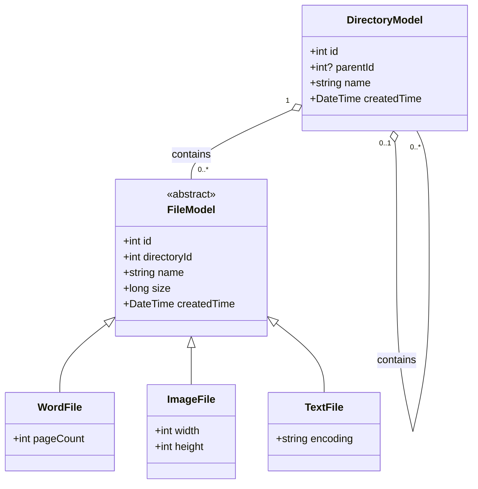
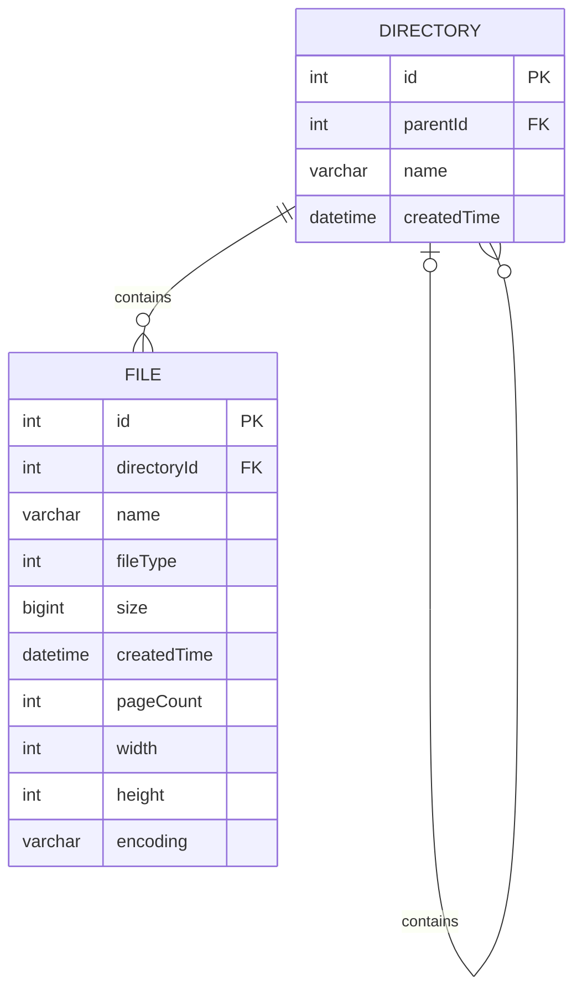

# Cloud File System

面試作業：雲端檔案管理系統，使用 **C# / ASP.NET Core** 實作後端核心邏輯，並使用 **Angular / TypeScript** 建立 Web UI。

---

## 1. Features

### Directory Structure

- 支援不限層級的目錄結構
- 每個檔案皆屬於一個目錄
- 支援 Word、Image、Text 三種檔案類型
- 顯示完整目錄結構與檔案資訊

### Calculate Total Size

遞迴走訪指定目錄下的所有子目錄與檔案，計算總容量。

執行過程會記錄 Traverse Log：

```text
Visiting: 根目錄
Visiting: 專案文件
Visiting: 需求規格書.docx
Visiting: 系統架構圖.png
...
```

### Search by Extension

可依副檔名搜尋指定目錄及所有子目錄中的檔案，例如：

```text
.docx
```

搜尋結果：

```text
根目錄/專案文件/需求規格書.docx
根目錄/個人筆記/2025 備份/舊會議記錄.docx
```

搜尋過程同樣會輸出 Traverse Log，以呈現節點的實際走訪順序。

### XML Serialization

可將目前完整目錄結構轉換為 XML：

```xml
<根目錄_Root>
  <專案文件_Project_Docs>
    <需求規格書_docx>頁數: 15, 大小: 500KB</需求規格書_docx>
    <系統架構圖_png>解析度: 1920x1080, 大小: 2MB</系統架構圖_png>
  </專案文件_Project_Docs>

  <個人筆記_Personal_Notes>
    <待辦清單_txt>編碼: UTF-8, 大小: 1KB</待辦清單_txt>

    <Archive_2025>
      <舊會議記錄_docx>頁數: 5, 大小: 200KB</舊會議記錄_docx>
    </Archive_2025>
  </個人筆記_Personal_Notes>

  <README_txt>編碼: ASCII, 大小: 500B</README_txt>
</根目錄_Root>
```

### Sorting

Web UI 額外實作排序功能，可依：

- 名稱
- 大小
- 副檔名

進行升冪或降冪排序。

---

# 2. Domain Model

檔案具有共同屬性：

- Name
- Size
- Created Time
- Directory

因此將 `FileModel` 設計為抽象基底類別，並由不同檔案類型繼承。

不同類型具有各自特有的資訊：

| File Type | Specific Property |
| --- | --- |
| WordFile | Page Count |
| ImageFile | Width / Height |
| TextFile | Encoding |

## UML Class Diagram



### Design

`FileModel` 定義所有檔案共有的屬性，`WordFile`、`ImageFile` 與 `TextFile` 透過繼承增加各自的特有資訊。

`DirectoryModel` 與 `FileModel` 為一對多關係，一個目錄可以包含多個檔案，而每個檔案必須屬於一個目錄。

`DirectoryModel` 同時具有 Self-Reference 關係，透過 `parentId` 建立父目錄與子目錄結構，因此可以支援不限層級的目錄階層。

---

# 3. ER Model

Domain Model 使用 Inheritance 表達不同檔案類型，而資料儲存則採用單一 `File` Entity。

目前 Word、Image、Text 的特殊欄位數量較少，因此沒有為每種檔案類型建立獨立資料表，而是透過 `fileType` 區分類型，降低額外 Table 與 JOIN 的複雜度。



### Directory

| Column | Type | Description |
| --- | --- | --- |
| id | INT PK | Directory ID |
| parentId | INT FK, NULL | Parent Directory ID，Root 為 NULL |
| name | VARCHAR | Directory Name |
| createdTime | DATETIME | Created Time |

### File

| Column | Type | Description |
| --- | --- | --- |
| id | INT PK | File ID |
| directoryId | INT FK, NOT NULL | 所屬 Directory |
| name | VARCHAR | File Name |
| fileType | INT | Word / Image / Text |
| size | BIGINT | File Size (Bytes) |
| createdTime | DATETIME | Created Time |
| pageCount | INT, NULL | Word Page Count |
| width | INT, NULL | Image Width |
| height | INT, NULL | Image Height |
| encoding | VARCHAR, NULL | Text Encoding |

檔案類型與特殊欄位的對應：

| Type | pageCount | width | height | encoding |
| --- | --- | --- | --- | --- |
| Word | ✓ | NULL | NULL | NULL |
| Image | NULL | ✓ | ✓ | NULL |
| Text | NULL | NULL | NULL | ✓ |

---

# 4. Sample Directory Structure

系統初始化以下測試資料：

```text
根目錄 (Root)
├── 專案文件 (Project_Docs)
│   ├── 需求規格書.docx
│   │   └── Page Count: 15, Size: 500KB
│   └── 系統架構圖.png
│       └── Resolution: 1920x1080, Size: 2MB
│
├── 個人筆記 (Personal_Notes)
│   ├── 待辦清單.txt
│   │   └── Encoding: UTF-8, Size: 1KB
│   └── 2025 備份 (Archive_2025)
│       └── 舊會議記錄.docx
│           └── Page Count: 5, Size: 200KB
│
└── README.txt
    └── Encoding: ASCII, Size: 500B
```

---

# 5. Architecture

Backend 採分層方式組織：

```text
Controller
    ↓
Handler
    ↓
Manager
    ↓
DAO
    ↓
Model
```

### Controller

負責提供 API Endpoint 並將請求交由 Handler 處理。

### Handler

負責主要 Business Logic，包括：

- 建立目錄樹
- Recursive Total Size Calculation
- Search by Extension
- Traverse Logging
- XML Serialization

### Manager

作為 Handler 與資料存取層之間的中介層。

### DAO

負責資料存取。

目前作業使用預先建立的 Sample Data 模擬資料來源，以專注於 Domain Modeling 與核心邏輯。

---

# 6. Recursive Tree Traversal

目錄與檔案會被轉換為 Tree Structure：

```text
FileSystemNode
      │
      ├── FileSystemNode
      │       ├── FileSystemNode
      │       └── FileSystemNode
      │
      └── FileSystemNode
```

每個 Directory Node 可以擁有多個 `children`，因此可以使用相同的 Recursive Traversal 處理不限層級的目錄。

例如總容量計算：

```text
Root
 ↓
Project_Docs
 ↓
需求規格書.docx
 ↓
系統架構圖.png
 ↓
Personal_Notes
 ↓
...
```

每次訪問節點時都會記錄 Traverse Log，以驗證演算法實際走訪的順序。

---

# 7. API

| Method | Endpoint | Description |
| --- | --- | --- |
| GET | `/api/FileSystem/getFileTree` | 取得完整檔案樹 |
| GET | `/api/FileSystem/calculateTotalSize?directoryId={id}` | 計算指定目錄總容量 |
| GET | `/api/FileSystem/searchByExtension?directoryId={id}&extension={extension}` | 搜尋指定副檔名 |
| GET | `/api/FileSystem/serializeToXml` | 將目錄結構轉換為 XML |

---

# 8. Technology Stack

### Backend

- C#
- ASP.NET Core
- LINQ
- System.Xml.Linq

### Frontend

- Angular
- TypeScript
- Bootstrap Icons
- HTML / CSS

---

# 9. Project Structure

```text
CloudFileSystem
├── Controllers
│   └── FileSystemController.cs
│
├── Handlers
│   └── FileSystemHandler.cs
│
├── Managers
│   ├── IDirectoryManager.cs
│   ├── IFileManager.cs
│   └── Impl
│       ├── DirectoryManager.cs
│       └── FileManager.cs
│
├── Daos
│   ├── DirectoryDao.cs
│   └── FileDao.cs
│
└── Models
    ├── DirectoryModel.cs
    ├── FileModel.cs
    ├── WordFile.cs
    ├── ImageFile.cs
    ├── TextFile.cs
    ├── FileSystemNode.cs
    ├── DirectorySize.cs
    └── ProcessResult.cs
```

---

# 10. Design Considerations

### Domain Model vs. Database Schema

Domain Model 與 Database Schema 採用不同的設計方式。

Domain Model 使用繼承：

```text
FileModel
├── WordFile
├── ImageFile
└── TextFile
```

以呈現不同檔案類型在物件導向模型中的 `is-a` 關係。

Database Schema 則使用單一 `File` Entity：

```text
Directory
    │
    └── File
```

透過 `fileType` 區分類型，並以 nullable columns 儲存不同類型的特殊屬性。

此設計在保留 Domain Model 表達能力的同時，避免目前僅有少量特殊欄位的情況下，為每種檔案類型建立額外 Table 所造成的 Schema 與 JOIN 複雜度。

### Extensibility

若未來新增更多 File Type 或各類型具有大量不同欄位，可再評估將 Persistence Model 改為其他 inheritance mapping strategy，或將各類型的特殊資訊拆分至獨立資料表。
